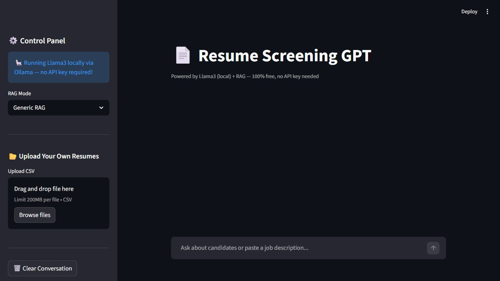
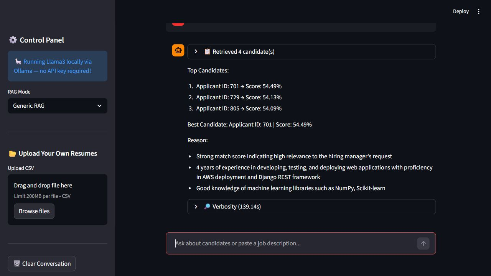
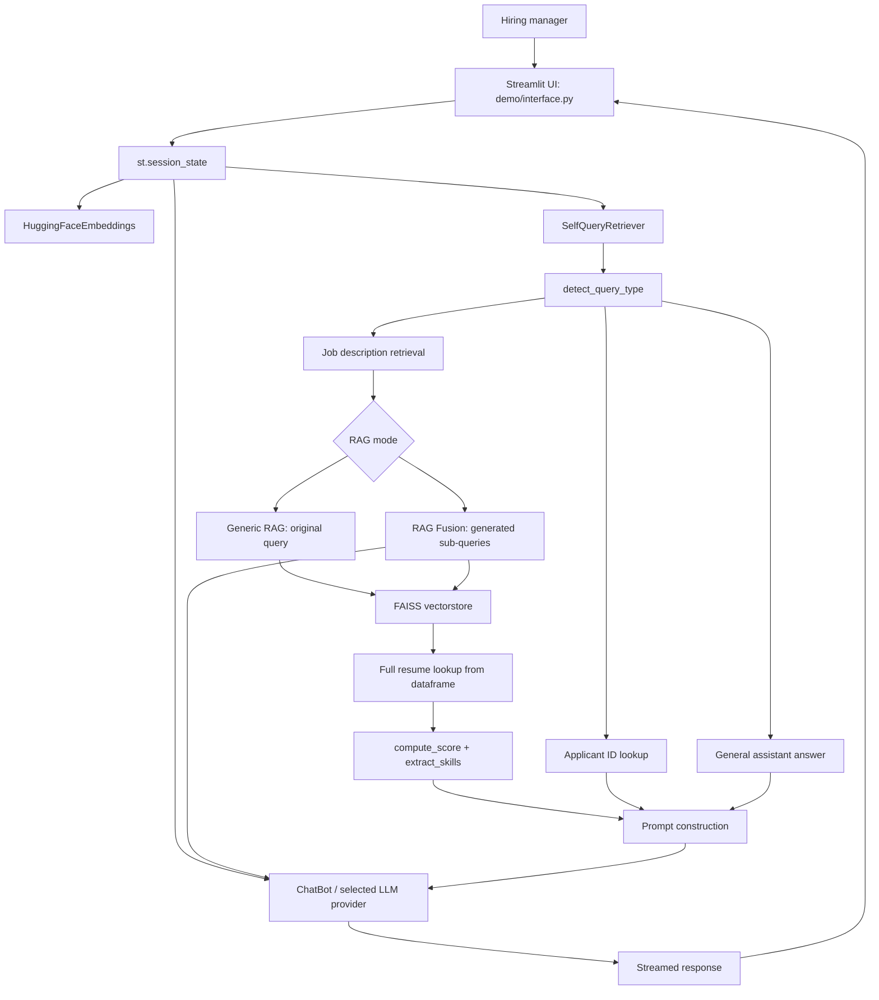
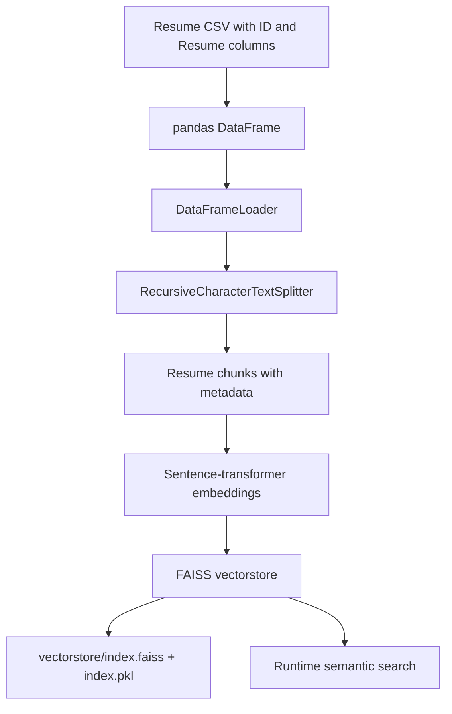
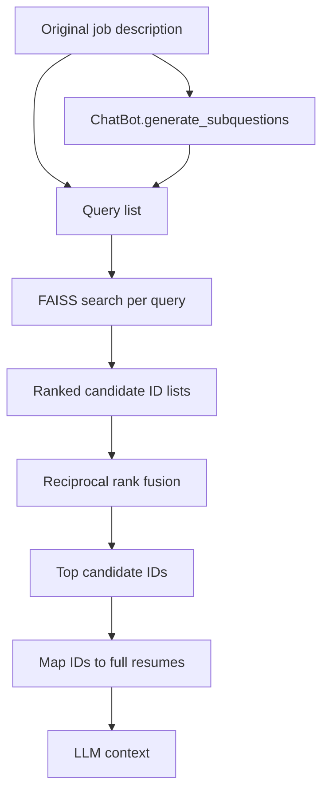
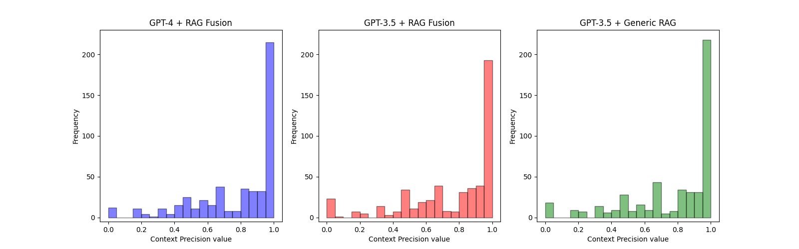
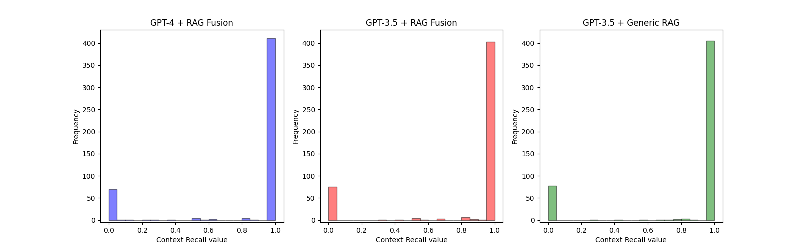
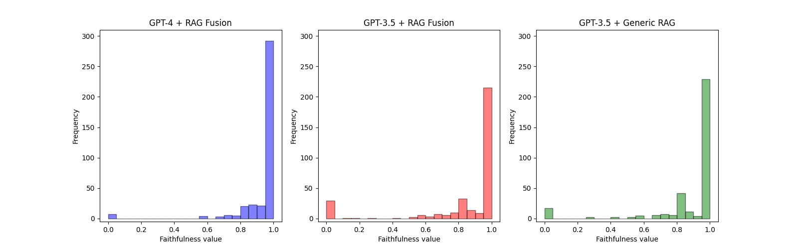
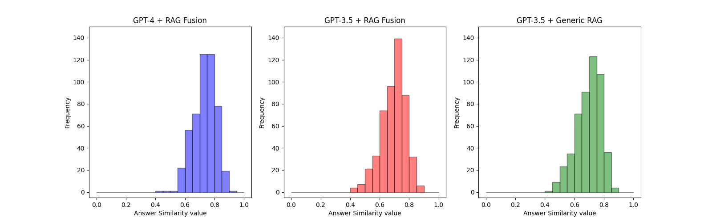

# Resume Screening RAG Pipeline

A Retrieval-Augmented Generation (RAG) resume screening assistant for helping hiring teams search, compare, and analyze candidate resumes against job descriptions.

The current runnable demo is a Streamlit application that uses:

- FAISS for vector search over resume chunks
- Hugging Face sentence-transformer embeddings
- LangChain for document loading, splitting, retrieval, and LLM integration
- Ollama or Gemini for chat and RAG Fusion query generation
- Pandas for resume CSV loading and uploaded dataset handling

The repository also contains research notebooks, generated test sets, evaluation outputs, PDF resume conversion utilities, and prebuilt vector indexes.

## Demo Preview

The Streamlit app opens directly into a chat-style resume screening assistant.


When the user provides a job description, the system retrieves matching candidates and produces a ranked hiring summary.


When the user asks about a specific applicant ID, the system performs an exact lookup and analyzes that candidate.


## Local Run Verification

The project was run locally with the repository virtual environment and Streamlit:

```powershell
cd D:\Saurav\project\Resume-Screening-RAG-Pipeline-main\Resume-Screening-RAG-Pipeline-main
..\.venv\Scripts\python.exe -m streamlit run demo/interface.py --server.port 8501 --server.headless true --server.fileWatcherType none
```

Verified locally:

- Streamlit served the app at `http://localhost:8501`.
- The app loaded the default `data/main-data/synthetic-resumes.csv` dataset.
- The FAISS vectorstore and Hugging Face embedding model initialized.
- Ollama had `llama3:latest` available.
- The UI rendered the sidebar, model controls, RAG mode selector, resume upload control, title, and chat input.
- A sample query, `Find Python developers with machine learning experience`, completed retrieval and generated a ranked candidate answer.

Startup screen from the local run:



Completed sample query from the local run:



## What The App Does

The assistant supports three main query paths:

1. Job description search
   - Detects hiring-style prompts such as "Find Python developers with ML experience".
   - Retrieves relevant resume chunks from FAISS.
   - Maps chunks back to full resumes.
   - Computes a keyword, bigram, and skill-density match score.
   - Returns ranked candidates and asks the LLM to summarize the top choices.

2. Applicant ID lookup
   - Detects numeric applicant IDs with at least three digits.
   - Fetches exact matching candidate resumes from the active dataset.
   - Produces a structured candidate analysis.

3. General recruitment questions
   - Skips retrieval when no job description, skill query, or applicant ID is detected.
   - Answers using the recent chat history and the local LLM.

## Current Demo Features

- Streamlit chat interface
- LLM provider switcher for Ollama and Gemini
- Configurable Ollama and Gemini model selections
- Generic RAG and RAG Fusion modes
- RAG Fusion sub-query generation
- Exact applicant ID retrieval
- Resume upload through CSV files
- Automatic FAISS vectorstore rebuild if `vectorstore` is missing
- Conversation clearing
- Retrieval verbosity panel showing:
  - query type
  - selected RAG mode
  - retrieved resumes
  - generated sub-queries
  - reciprocal-rank-fusion scores
  - elapsed time

## Architecture

The application is built around a retrieval layer and a generation layer. The retrieval layer decides whether the user query needs resume context, finds relevant candidates, and prepares candidate data. The generation layer uses the retrieved resume text plus the user's request to produce a recruiter-friendly answer.


At a lower level, resumes are embedded into a FAISS vectorstore. For job descriptions, the query is embedded, candidate chunks are retrieved, and RAG Fusion can expand the original query into multiple focused sub-queries before re-ranking.


### Runtime Architecture



### Data And Indexing Architecture



### RAG Fusion Architecture



## How It Works End To End

1. The user submits a message in the Streamlit chat UI.
2. `SelfQueryRetriever.retrieve_docs()` classifies the message.
3. If the message contains applicant IDs, the retriever directly searches the active dataframe by `ID`.
4. If the message looks like a job description or skill search, the retriever uses FAISS similarity search.
5. If RAG Fusion is selected, `ChatBot.generate_subquestions()` asks Llama3 to split the job description into 3-4 focused search queries.
6. The vectorstore retrieves candidate chunks for each query.
7. Candidate chunk IDs are combined and re-ranked with reciprocal rank fusion.
8. The selected IDs are mapped back to full resume text from the dataframe.
9. Each full resume receives a readable match score based on keyword overlap, bigram overlap, and skill density.
10. The ranked resumes are sent to Llama3 as context.
11. Llama3 streams a structured answer back to Streamlit.
12. The verbosity panel shows what was retrieved, what sub-queries were used, and how long the run took.

This flow gives the LLM concrete resume context instead of asking it to answer from memory.

## Retrieval Logic In Detail

### Query classification

`detect_query_type()` checks the user message in this order:

- A number with at least three digits means applicant ID lookup.
- Hiring keywords such as `find`, `hire`, `candidate`, `developer`, `engineer`, `manager`, or `years of experience` mean job description retrieval.
- Known skill terms such as `python`, `react`, `sql`, `tensorflow`, `aws`, `docker`, or `scrum` also trigger job description retrieval.
- Anything else is treated as a general recruitment question.

### Generic RAG

Generic RAG uses the original user query only:

```text
User job description -> FAISS search -> candidate IDs -> full resumes -> LLM response
```

This is faster and simpler.

### RAG Fusion

RAG Fusion expands the original query:

```text
User job description
-> Llama3 generated sub-queries
-> FAISS search for each query
-> reciprocal rank fusion
-> candidate IDs
-> full resumes
-> LLM response
```

This can improve retrieval when the job description is long, broad, or contains several different requirements.

### Match scoring

The displayed match score is not the raw FAISS score. It is a presentation score computed from:

- unigram keyword overlap
- bigram phrase overlap, weighted higher than single words
- a small skill-density bonus

This makes the ranked output easier for users to read while FAISS still handles semantic retrieval.

## Generation Logic In Detail

The app uses different prompts depending on the query type:

- Job description retrieval: return the top candidates, preserve ranking order, choose the best candidate, and explain why.
- Applicant ID lookup: summarize strengths, weaknesses, and an overall recommendation.
- General question: answer as a recruitment assistant using recent chat history.

Responses are streamed through Streamlit with `st.write_stream()`, so the answer appears progressively.

## Runtime Data Structures

### Session state

`demo/interface.py` keeps long-lived objects in `st.session_state` so Streamlit reruns do not recreate expensive resources on every interaction.

| Key | Created in | Purpose |
| --- | --- | --- |
| `chat_history` | `interface.py` | Stores `HumanMessage`, `AIMessage`, and verbosity render tuples. |
| `resume_list` | `interface.py` | Stores the latest retrieved resume context list. |
| `embedding_model` | `interface.py` | Reuses the Hugging Face embedding model. |
| `df` | `interface.py` | Active resume dataframe, either default synthetic data or uploaded CSV. |
| `rag_pipeline` | `interface.py` | Active `SelfQueryRetriever` connected to the active vectorstore and dataframe. |
| `llm` | `interface.py` | Cached `ChatBot` wrapper around the selected provider/model. |
| `llm_provider` | Sidebar selectbox | Current LLM backend: `Ollama` or `Gemini`. |
| `ollama_model` | Sidebar selectbox | Current local Ollama model. |
| `gemini_model` | Sidebar selectbox | Current Gemini API model. |
| `llm_signature` | `interface.py` | Provider/model tuple used to refresh the cached LLM only when needed. |
| `rag_selection` | Streamlit selectbox | Current mode: `Generic RAG` or `RAG Fusion`. |

### Retriever metadata

`SelfQueryRetriever` updates a `meta_data` dictionary on every retrieval. The verbosity UI reads this object.

```python
{
    "rag_mode": "",
    "query_type": "no_retrieve",
    "extracted_input": "",
    "subquestion_list": [],
    "retrieved_docs_with_scores": [],
}
```

Meaning:

- `rag_mode`: selected Streamlit RAG mode.
- `query_type`: one of `retrieve_applicant_jd`, `retrieve_applicant_id`, or `no_retrieve`.
- `extracted_input`: parsed IDs or job description payload.
- `subquestion_list`: original query plus generated sub-queries when RAG Fusion is used.
- `retrieved_docs_with_scores`: fused candidate ID scores after retrieval.

### Retrieved document format

For job description retrieval, each selected resume is formatted like this before it is passed to the LLM:

```text
Applicant ID: <id>
Match Score: <score>%
Skills: <comma-separated skills>

<full resume text>
```

For applicant ID lookup, the format is simpler:

```text
Applicant ID <id>
<full resume text>
```

## Function-By-Function Walkthrough

### `demo/interface.py`

This is the Streamlit entry point and runtime coordinator. It does not define custom functions, but its top-level blocks act as the application lifecycle.

| Block | What it does | Why it matters |
| --- | --- | --- |
| Imports | Loads Streamlit, Pandas, LangChain message types, FAISS, embeddings, `ChatBot`, `ingest`, and `SelfQueryRetriever`. | Connects the UI, retrieval, vectorstore, and model layers. |
| Config constants | Defines `DATA_PATH`, `FAISS_PATH`, `EMBEDDING_MODEL`, model lists, and provider defaults. | These control the default resume CSV, default local FAISS folder, embedding model, and selectable LLM backends. |
| Page setup | Calls `st.set_page_config()`, `st.title()`, and `st.caption()`. | Gives the app its visible title and multi-provider positioning. |
| `chat_history` init | Creates an empty chat list when missing. | Preserves conversation turns across Streamlit reruns. |
| `resume_list` init | Creates an empty list for latest retrieved resumes. | Lets the app keep retrieval context available after a query. |
| `embedding_model` init | Builds `HuggingFaceEmbeddings(model_name="sentence-transformers/all-MiniLM-L6-v2")`. | Embeddings are expensive, so the app caches them in session state. |
| `df` init | Reads `data/main-data/synthetic-resumes.csv`. | Provides the default resume corpus. |
| `rag_pipeline` init | Loads FAISS from `vectorstore`; if loading fails, rebuilds with `ingest()`. | Makes the app resilient when the index is missing. |
| LLM defaults init | Creates default provider/model values from `.env` or built-in defaults. | Lets the app start with Ollama by default while allowing Gemini configuration. |
| Sidebar | Provides provider/model selection, RAG mode selection, CSV upload, clear conversation, examples, and about text. | Gives non-code controls for changing retrieval behavior, model backend, and dataset. |
| `llm` init | Creates or refreshes one `ChatBot(provider, model)` instance. | Avoids recreating the LLM wrapper unless the selected provider/model changes. |
| Upload branch | Validates uploaded CSV columns, builds a new FAISS index in memory, and swaps the active retriever/dataframe. | Lets users test their own resumes without editing files. |
| Chat history rendering | Replays `HumanMessage`, `AIMessage`, and verbosity tuples. | Keeps the chat transcript visible after reruns. |
| Chat input branch | Runs retrieval, shows retrieved candidates, streams the LLM response, renders verbosity, and appends history. | This is the main request-response loop. |

### `demo/retriever.py`

This file contains query routing, scoring, and retrieval.

#### Constants

| Name | Purpose |
| --- | --- |
| `RAG_K_THRESHOLD = 5` | Number of candidate chunks retrieved per query before fusion. |
| `SKILLS` | Known skill list used for skill-triggered retrieval and skill extraction. |
| `JD_KEYWORDS` | Hiring/job-description keywords used to detect retrieval-worthy user prompts. |

#### `detect_query_type(question: str)`

Classifies the user message.

Return values:

| Return type | Parsed payload | When it happens |
| --- | --- | --- |
| `retrieve_applicant_id` | `{"id_list": [...]}` | The message contains one or more 3+ digit numbers. |
| `retrieve_applicant_jd` | `{"job_description": question}` | The message contains hiring keywords or known skills. |
| `no_retrieve` | `{}` | No resume retrieval signal is detected. |

This function is intentionally lightweight and rule-based. It avoids spending LLM calls just to decide whether retrieval is needed.

#### `compute_score(query: str, resume_text: str) -> float`

Computes a readable match percentage for presentation.

Steps:

1. Lowercase the query and resume.
2. Build unigram sets from whitespace-split words.
3. Build bigram sets from adjacent token pairs.
4. Count unigram overlap.
5. Count bigram overlap and weight each bigram match as `2`.
6. Normalize by total query terms.
7. Add a skill-density bonus up to `2` points.
8. Round the final score to two decimals.

This score is separate from the FAISS vector similarity score. FAISS finds candidates semantically; `compute_score()` makes the final list easier to read.

#### `extract_skills(text: str) -> list`

Lowercases resume text and returns every skill from `SKILLS` that appears in the resume.

This is used for:

- the skill-density score bonus
- the `Skills:` line shown in retrieved candidate context

#### `class RAGRetriever`

Base retriever that knows how to search FAISS and map retrieved IDs back to full resumes.

| Method | Working |
| --- | --- |
| `__init__(vectorstore_db, df)` | Stores the active FAISS vectorstore and active dataframe. |
| `__retrieve_docs_id__(question, k=50)` | Runs `similarity_search_with_score()` and returns `{applicant_id: score}`. |
| `__reciprocal_rank_fusion__(document_rank_list, k=50)` | Merges several ranked result lists by adding `1 / (rank + k)` for each candidate. |
| `retrieve_id_and_rerank(subquestion_list)` | Retrieves candidate IDs for every query and fuses the ranked lists. |
| `retrieve_documents_with_id(doc_id_with_score, threshold=5, query="")` | Selects top IDs, maps them to full resumes, computes scores/skills, formats context strings, and sorts by match score. |

#### `class SelfQueryRetriever(RAGRetriever)`

The application-level retriever used by Streamlit.

| Method | Working |
| --- | --- |
| `__init__(vectorstore_db, df)` | Calls the base retriever and initializes `meta_data`. |
| `retrieve_docs(question, llm, rag_mode)` | Classifies the query, runs the correct retrieval branch, stores metadata, and returns document context. |

`retrieve_docs()` has three branches:

1. `retrieve_applicant_id`
   - Loops through parsed IDs.
   - Filters `df` where `ID` matches.
   - Returns exact resume text.
   - Silently skips missing IDs.

2. `retrieve_applicant_jd`
   - Starts with the original user question.
   - If mode is `RAG Fusion`, asks `llm.generate_subquestions()` for more focused queries.
   - Retrieves and fuses candidate IDs.
   - Converts IDs to full scored resume context.

3. `no_retrieve`
   - Returns an empty list.
   - The LLM answers from general recruitment knowledge and chat history.

### `demo/llm_agent.py`

This file wraps the selected LLM backend. Ollama is the default local provider, and Gemini is available when `langchain-google-genai` and an API key are configured.

#### `class ChatBot`

| Method | Working |
| --- | --- |
| `__init__(provider, model)` | Stores the selected provider/model and builds the matching LLM client. |
| `_build_ollama()` | Uses `langchain-ollama` when installed, with a fallback to the older LangChain community Ollama wrapper. |
| `_build_gemini()` | Uses `ChatGoogleGenerativeAI` and requires `GOOGLE_API_KEY` or `GEMINI_API_KEY`. |
| `_to_text(response)` | Normalizes string, message, and chunk responses into plain text. |
| `_stream_text(prompt)` | Streams text chunks consistently across providers. |
| `generate_subquestions(question)` | Prompts the selected model to produce 3-4 focused search queries, strips numbering/bullets, removes short stray lines, and returns up to four queries. |
| `generate_message_stream(question, docs, history, prompt_cls)` | Builds the final prompt for the current query type and returns provider-normalized streamed text. |

`generate_message_stream()` has three prompt modes:

1. `retrieve_applicant_jd`
   - Provides ranked retrieved resumes.
   - Instructs the LLM not to reorder candidates.
   - Requires top 3 candidates, best candidate, score, and reasons.

2. `retrieve_applicant_id`
   - Provides one or more exact candidate resumes.
   - Requests strengths, weaknesses, and an overall recommendation.

3. `no_retrieve`
   - Converts the latest chat history into readable text.
   - Asks the LLM to answer as a recruitment assistant.

### `demo/ingest_data.py`

This file builds a FAISS vectorstore from a dataframe.

#### `ingest(df, content_column, embedding_model)`

Steps:

1. Wrap the dataframe with `DataFrameLoader`.
2. Split documents with `RecursiveCharacterTextSplitter`.
3. Use `chunk_size=1000` and `chunk_overlap=150`.
4. Embed chunks with the provided embedding model.
5. Build a FAISS vectorstore with cosine distance.
6. Return the vectorstore.

The app uses this function when:

- the default `vectorstore` folder is missing or cannot be loaded
- a user uploads a custom resume CSV

### `demo/chatbot_verbosity.py`

This file renders the debug/trace panel under each assistant response.

#### `render(document_list, meta_data, time_elapsed)`

Working:

1. Maps the query type to a readable status message.
2. Opens a Streamlit expander with elapsed time.
3. For job description retrieval:
   - shows selected RAG mode
   - shows top retrieved resumes in popovers
   - lists sub-queries
   - lists top re-ranking scores
4. For applicant ID retrieval:
   - shows matched resumes in popovers
   - shows extracted IDs

This is useful for debugging retrieval quality because it exposes what the model actually received.

### `demo/interactive/convert_pdf.py`

Utility script for converting PDF resumes into a CSV dataset.

Working:

1. Finds PDF files under `data/supplementary-data/pdf-resumes/`.
2. Opens each file with `PdfReader`.
3. Extracts text from every page.
4. Writes rows to `data/supplementary-data/pdf-resumes.csv`.
5. Assigns sequential numeric IDs starting at `0`.

### `demo/interactive/ingest_data.py`

Utility script for building a FAISS index from environment variables.

It reads:

- `DATA_PATH`
- `EMBEDDING_MODEL`
- `FAISS_PATH`

Then it loads the CSV, splits the `Resume` column, builds embeddings, saves FAISS locally, and prints elapsed time.

Note: this older utility uses `chunk_size=1024` and `chunk_overlap=500`, while the current app ingestion path uses `chunk_size=1000` and `chunk_overlap=150`.

## Project Structure

```text
Resume-Screening-RAG-Pipeline-main/
|-- README.md                         # Root README, current project guide
`-- Resume-Screening-RAG-Pipeline-main/
    |-- README.md                     # Original project README
    |-- requirements.txt
    |-- demo/
    |   |-- interface.py              # Streamlit app entry point
    |   |-- llm_agent.py              # Ollama/Llama3 prompting and streaming
    |   |-- retriever.py              # Query detection, scoring, RAG retrieval
    |   |-- ingest_data.py            # FAISS vectorstore builder
    |   |-- chatbot_verbosity.py      # Retrieval/debug UI panel
    |   `-- interactive/
    |       |-- convert_pdf.py        # Convert PDF resumes to CSV
    |       `-- ingest_data.py        # Environment-driven FAISS ingestion script
    |-- preprocessing/
    |   |-- data_cleaning.ipynb       # Job description and resume preprocessing
    |   `-- data_ingestion.ipynb      # Notebook-based vectorstore creation
    |-- evaluation/
    |   |-- testset_generation.ipynb  # Synthetic test set generation
    |   |-- results_generation.ipynb  # RAG result generation
    |   |-- ragas_evaluation.ipynb    # RAGAS metric computation
    |   |-- metrics_computation.ipynb # Accuracy and metric plots
    |   `-- images/                   # Saved evaluation plots
    |-- data/
    |   |-- main-data/                # Synthetic resumes, test sets, results
    |   `-- supplementary-data/       # Source job descriptions and PDF resumes
    |-- vectorstore/                  # Default FAISS index for the demo
    |-- vectorstore-pdf/              # FAISS index for PDF-derived resumes
    `-- vectorstore-synthetic/        # FAISS index for synthetic resumes
```

## Core Code Flow

### Streamlit app

`demo/interface.py` is the main entry point.

It loads:

- `data/main-data/synthetic-resumes.csv`
- `vectorstore`
- `sentence-transformers/all-MiniLM-L6-v2`
- `SelfQueryRetriever`
- `ChatBot`

If the FAISS index cannot be loaded, the app rebuilds it from the active resume dataframe and saves it to `vectorstore`.

### Retriever

`demo/retriever.py` handles:

- skill and hiring keyword detection
- applicant ID detection
- FAISS similarity search
- reciprocal rank fusion
- full resume reconstruction from retrieved IDs
- match score calculation
- skill extraction

RAG Fusion uses the original query plus generated sub-queries, retrieves candidates for each, and re-ranks them with reciprocal rank fusion.

### LLM Agent

`demo/llm_agent.py` wraps the selected model provider:

```python
ChatBot(provider="ollama", model="llama3")
ChatBot(provider="gemini", model="gemini-1.5-flash")
```

It provides:

- provider/model abstraction for Ollama and Gemini
- sub-query generation for RAG Fusion
- structured candidate recommendation prompts
- structured applicant ID analysis prompts
- general recruitment assistant prompts using recent chat history

### Vectorstore Ingestion

`demo/ingest_data.py` builds FAISS indexes from a dataframe column.

Current chunking:

- chunk size: `1000`
- chunk overlap: `150`
- distance strategy: cosine

## Data Files

Important CSV schemas:

- `data/main-data/synthetic-resumes.csv`
  - columns: `ID`, `Resume`
- uploaded resume CSVs
  - required columns: `ID`, `Resume`
- `data/main-data/test-sets/testset-*.csv`
  - columns: `Job Description`, `Ground Truth`
- generated/evaluation result CSVs
  - usually include `question`, `ground_truth`, `answer`, `contexts`
- supplementary job descriptions
  - columns: `Job Title`, `Job Description`

The repository includes many large data and result files. They are used as datasets and experiment outputs, not as application source code.

## Requirements

- Python 3.10 or 3.11 recommended
- Ollama installed locally
- At least one Ollama model pulled locally, such as `llama3`
- Gemini API key if using the Gemini provider
- Enough disk space for embeddings, FAISS indexes, and the included datasets

Install Python packages from inside the nested project directory:

```powershell
cd D:\Saurav\project\Resume-Screening-RAG-Pipeline-main\Resume-Screening-RAG-Pipeline-main
python -m venv .venv
.\.venv\Scripts\Activate.ps1
pip install -r requirements.txt
```

Copy the example environment file if you want to configure defaults:

```powershell
copy .env.example .env
```

Do not commit your real `.env` file.

## Ollama Setup

Install Ollama, then pull Llama3:

```powershell
ollama pull llama3
```

Make sure the Ollama service is running before starting the Streamlit app:

```powershell
ollama serve
```

If Ollama is already running as a desktop/background service, you do not need to run `ollama serve` again.

## Gemini Setup

Gemini support is optional. It is only required when the sidebar provider is set to `Gemini`.

1. Install dependencies from `requirements.txt`.
2. Set one of these environment variables in `.env` or your shell:

```env
GOOGLE_API_KEY=your_google_api_key_here
# or
GEMINI_API_KEY=your_google_api_key_here
```

3. Optionally choose a default Gemini model:

```env
LLM_PROVIDER=Gemini
GEMINI_MODEL=gemini-1.5-flash
```

When Gemini is selected without an API key, the UI shows a clear configuration error instead of failing silently.

## Provider Selection

The sidebar includes:

- `LLM Provider`: `Ollama` or `Gemini`
- `Ollama Model`: shown when Ollama is selected
- `Gemini Model`: shown when Gemini is selected
- `RAG Mode`: `Generic RAG` or `RAG Fusion`

The retrieval pipeline does not change when providers change. FAISS retrieval, resume lookup, scoring, and verbosity stay the same; only the LLM used for sub-query generation and response generation changes.

## Run The Demo

From the nested project directory:

```powershell
cd D:\Saurav\project\Resume-Screening-RAG-Pipeline-main\Resume-Screening-RAG-Pipeline-main
streamlit run demo/interface.py
```

Streamlit will print a local URL, usually:

```text
http://localhost:8501
```

## Example Queries

```text
Find Python developers with machine learning experience
Hire a senior backend engineer with API and SQL skills
Who has TensorFlow experience?
Show applicant 101
Compare the top 3 candidates
```

## Uploading Your Own Resumes

Use the sidebar upload control with a CSV containing:

```csv
ID,Resume
101,"Resume text here..."
102,"Another resume text here..."
```

After upload, the app:

1. Reads the CSV into a dataframe.
2. Validates that `ID` and `Resume` columns exist.
3. Builds a fresh FAISS vectorstore in memory.
4. Replaces the active retriever and dataframe for the current session.

Uploaded indexes are not saved to disk by the current UI path.

## Rebuilding The Default Vectorstore

The app automatically rebuilds `vectorstore` if it cannot load the existing index.

To force a rebuild manually:

1. Stop Streamlit.
2. Rename or remove the nested `vectorstore` directory.
3. Start Streamlit again.

The rebuilt vectorstore will be based on:

```text
data/main-data/synthetic-resumes.csv
```

## PDF Resume Conversion

`demo/interactive/convert_pdf.py` converts PDF files from:

```text
data/supplementary-data/pdf-resumes/
```

into:

```text
data/supplementary-data/pdf-resumes.csv
```

It extracts text with `pypdf.PdfReader` and writes rows with `ID` and `Resume`.

## Research And Evaluation Notebooks

The notebooks under `preprocessing/` and `evaluation/` document the original research workflow:

- cleaning job description data
- preparing synthetic resumes
- building FAISS indexes
- generating test sets
- producing RAG/RAG Fusion answers
- evaluating with RAGAS metrics:
  - context precision
  - context recall
  - faithfulness
  - answer similarity
- computing selection accuracy and semantic similarity

Some notebook cells still reference OpenAI or Azure OpenAI style endpoints. The current Streamlit demo does not require an OpenAI API key. It can run locally with Ollama, or use Gemini when a Google API key is configured.

## Evaluation Images

The repository includes saved plots from the research evaluation workflow.

| Metric | Plot |
| --- | --- |
| Context Precision |  |
| Context Recall |  |
| Faithfulness |  |
| Answer Similarity |  |

## Troubleshooting

### `ModuleNotFoundError: langchain_huggingface`

Install the missing package:

```powershell
pip install langchain-huggingface
```

### `ModuleNotFoundError: langchain_google_genai`

Install the Gemini integration:

```powershell
pip install langchain-google-genai
```

You only need this package when using the Gemini provider.

### Gemini API key error

If Gemini is selected, set one of these variables:

```env
GOOGLE_API_KEY=your_google_api_key_here
GEMINI_API_KEY=your_google_api_key_here
```

Then restart Streamlit so `load_dotenv()` can read the updated `.env` file.

### Ollama connection error

Confirm your selected Ollama model is installed:

```powershell
ollama list
```

If `llama3` is missing:

```powershell
ollama pull llama3
```

Then make sure Ollama is running.

### FAISS load error

The app loads FAISS with `allow_dangerous_deserialization=True` because LangChain FAISS indexes include pickle metadata. Only load indexes you trust.

If loading fails, let the app rebuild the index from the resume CSV.

### CSV upload error

Uploaded files must include:

```text
ID, Resume
```

The column names are case-sensitive in the current code.

### Slow first run

The first run may download the embedding model and build or load FAISS indexes. Later runs should be faster because the model and vectorstore are cached locally.

## Notes For Development

- The app stores `ChatBot`, embeddings, dataframe, retriever, and chat history in `st.session_state`.
- `ChatBot` is cached in session state and recreated only when the selected provider/model changes.
- The retriever uses small-to-big retrieval: chunk-level similarity search returns IDs, then full resumes are sent to the LLM.
- The scoring helper is keyword-based and separate from FAISS similarity; it is used to present readable match percentages.
- The `.env` file should not contain committed real secrets. Use `.env.example` as the template.

## License

This project includes an Apache License 2.0 file in the nested project directory.

## Acknowledgements

The original project was created as a resume screening RAG proof of concept and was inspired by RAG Fusion.
